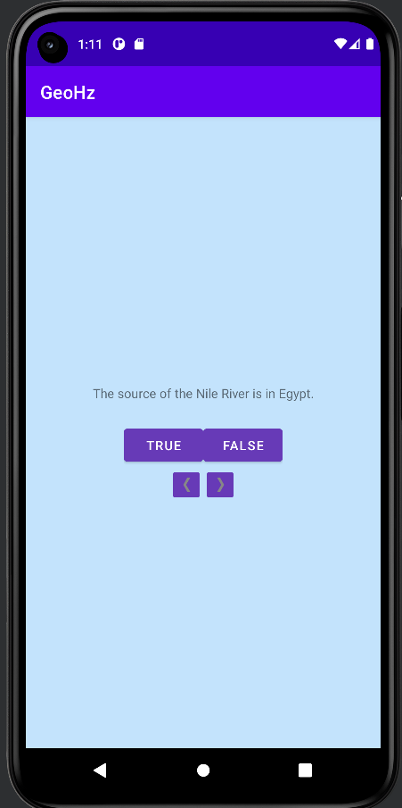

МИНИСТЕРСТВО НАУКИ И ВЫСШЕГО ОБРАЗОВАНИЯ
РОССИЙСКОЙ ФЕДЕРАЦИИ
ФЕДЕРАЛЬНОЕ ГОСУДАРСТВЕННОЕ БЮДЖЕТНОЕ
ОБРАЗОВАТЕЛЬНОЕ УЧРЕЖДЕНИЕ ВЫСШЕГО ОБРАЗОВАНИЯ
«САХАЛИНСКИЙ ГОСУДАРСТВЕННЫЙ УНИВЕРСИТЕТ»

      

Институт естественных наук и техносферной безопасности Кафедра информатики Чагочкин Никита

   

Лабораторная работа №2 «Android и модель MVC». 01.03.02 Прикладная математика и информатика

            

Научный руководитель 
Соболев Евгений Игоревич

   

г. Южно-Сахалинск 2023 г.

***
# 
1.Добавление слушателя для TextView 

Кнопка NEXT удобна, но было бы неплохо, если бы пользователь мог переходить к следующему вопросу простым нажатием на виджет TextView. 
Подсказка. Для TextView можно использовать слушателя View.OnClickListener, который использовался с Button, потому что класс TextView также является производным от View. 
***
## 
Решение

            questionTextView.setOnClickListener{
            updateQuestion()
            }
# 
2.Добавление кнопки возврата

Добавьте кнопку для возвращения к предыдущему вопросу. Пользовательский интерфейс должен выглядеть примерно так, как показано на рис. 2.13. 
***
## 
Решение

            prevButton.setOnClickListener {
            backQuestion()
            }

            private fun backQuestion() {
            currentIndex = (currentIndex - 1) % questionBank.size
            val questionTextResId = questionBank[currentIndex].textResId
            questionTextView.setText(questionTextResId)
            }
# 
3.От Button к ImageButton 

Возможно, пользовательский интерфейс будет смотреться еще лучше, если на кнопках будут отображаться только значки, как на рис. 2.14.
***
## 
Решение

        private lateinit var nextButton:ImageButton
        private lateinit var prevButton:ImageButton

        <ImageButton
            android:id="@+id/prev_button"
            android:layout_width="wrap_content"
            android:layout_height="wrap_content"
            android:backgroundTint="#673AB7"
            android:src="@drawable/arrow_left" />

        <ImageButton
            android:id="@+id/next_button"
            android:layout_width="wrap_content"
            android:layout_height="wrap_content"
            android:backgroundTint="#673AB7"
            android:src="@drawable/arrow_right"
            android:textAlignment="textEnd" />
        
